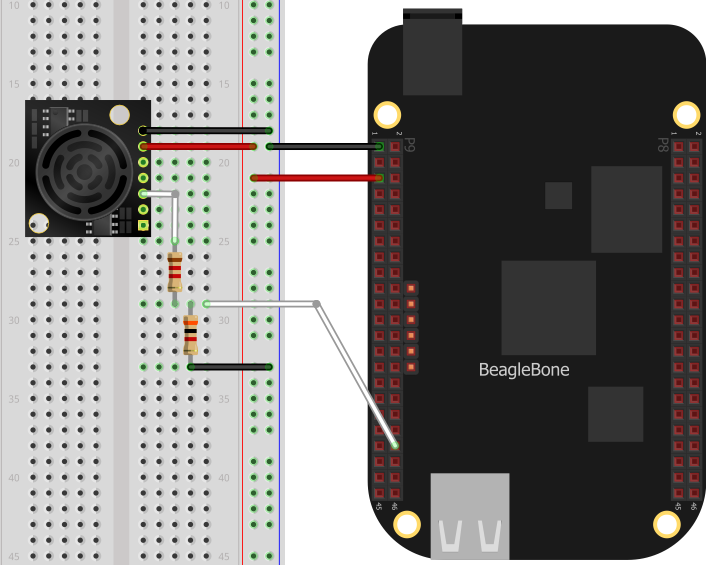

# Demo: Maxbotic Ultrasonic Sensor

The [LV-MaxSonar-EZ2 High Performance Sonar Range Finder](http://www.maxbotix.com/Ultrasonic_Sensors/MB1020.htm) 
provides very short to long-range detection and ranging, in an incredibly small package. 
The sonar detects objects from 0-254 inches and provides sonar range information 
from 6-inches out to 254-inches with 1-inch resolution.

*Note: Each time after the Sonar is powered up, it will calibrate during its first read cycle. 
The sensor uses this stored information to range a near object. 
It is important that objects not be close to the sensor during this calibration cycle. 
The best sensitivity is obtained when it is clear for fourteen inches, 
but good results are common when clear for at least seven inches. 
If an object is too bear the Sonar during the calibration cycle, 
the sensor may then ignore the objects at that distance. 
To calibrate the LV-MAX Sonar, cycle power then command a read cycle.*

The AN pin outputs a voltage with a scaling factor of (Vcc/512) per inch. 
Since the AIN pin has a maximum voltage capacity of 1.8V, 
we will set a voltage divider to account for that difference. 
With the voltage divider, a supply of 5V yields ~6.99mV/in. and 3.3V yields ~4.57mV/in.

## Build and execute instructions
* Connect the "GND" pin from the sensor to P9_1 of the board
* Connect the "+5" pin from the sensor to P9_3 of the board
* Connect the 1.2kohm resistor to the AN pin of the supersonic sensor.
* Connect the 3k ohm resistor in series with the 1.2k ohm resistor and tie the 
bottom to ground, as shown in the diagram.
* Connect P9_40 of BeagleBone in series with the 3k ohm and 1.k ohm resistor.
* Click "Run" on the code and it will output the distance, in inches,
that the sensor is detecting... updating every 5 seconds
* Move the sensor nearer to or farther from an object to see the change in distance
