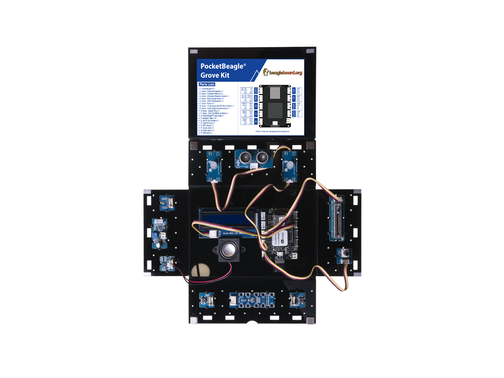

## Lesson - 1. Control the Light

### Description:

In this lesson, students will light up the RGB LED and LCD, and learn how to use Slide Potentiometer and Rotary Angle Sensor to change the light of RGB LED.

### Hardware Requirement:

- [Grove - Slide Potentiometer](https://www.seeedstudio.com/Grove-Slide-Potentiometer.html)
- [Grove - Rotary Angle Sensor](http://wiki.seeedstudio.com/Grove-Rotary_Angle_Sensor/)
- [Grove - Chainable RGB LED](http://wiki.seeedstudio.com/Grove-Chainable_RGB_LED/)
- [Grove - 16x2 LCD](http://wiki.seeedstudio.com/Grove-16x2_LCD_Series/)

### Hardware Connection
 
- Plug the Grove - Slide Potentiometer into **A0** port
- Plug the Grove - Rotary Angle Sensor into **A5** port
- Plug the Grove - Chainable RGB LED into **A2** port
- Plug the Grove - 16x2 LCD into **I2C1** port
- Plug the WiFi dongle into the **USB** Port
- Power PocketBeagle via the **micro USB** port

### Software

- Step 1. Enter Cloud9 IDE by typing IP of PocketBeagle
- Step 2. Select PocketBeagle -> Grove
- Step 3. Run the Control_the_Light.py by using Runner:Python.

### Success
        Now please turn the rotary angle sensor slowly and slide Slide Potentiometer, and see how the RGB LED changes it's light and color.

