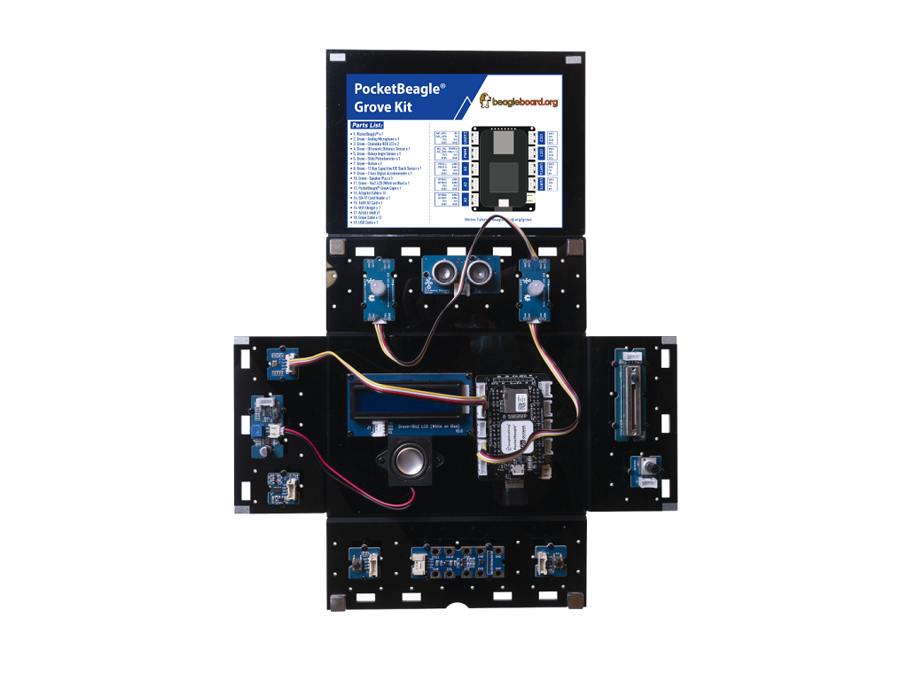

## Lesson - 8. Hello Kitt-AI

### Description:

In this lesson, students will learn how to install the snowboy of Kitt-AI and use it.

### Hardware Requirement:

- [Grove - Analog Microphone](http://wiki.seeedstudio.com/Grove-Analog-Microphone)
- [Grove - Speaker Plus](http://wiki.seeedstudio.com/Grove-Speaker/)
- [Grove - Chainable RGB LED](http://wiki.seeedstudio.com/Grove-Chainable_RGB_LED/)

### Hardware Connection

- Plug the Grove - Speaker Plus into **UART2** port
- Plug the Grove - Analog Microphone into **PWM** port
- Plug the Chainable RGB LED into **A2** port
- Plug the WiFi dongle into the **USB** Port
- Power PocketBeagle via the micro **USB** port

### Software

- Step 1. Enter Cloud9 IDE by typing IP of PocketBeagle
- Step 2. Select PocketBeagle -> Grove
- Step 3. Search Ok_Beagle hotword model through [snowboy](https://snowboy.kitt.ai/dashboard)
- Step 4. Click the `Record and Download` to provide data of sound for Ok_Beagle.
- Step 5. Download the Ok_Beagle.pmdl from the [website](https://snowboy.kitt.ai/hotword/46889)
- Step 6. Darg Ok_Beagle.pmdl to Cloud9 like lesson4
- Step 7. Run the Ok_Beagel.py by using Runner:Python.

### Success
        The RGB LED will light up when we say Ok_Beagle to mic.
