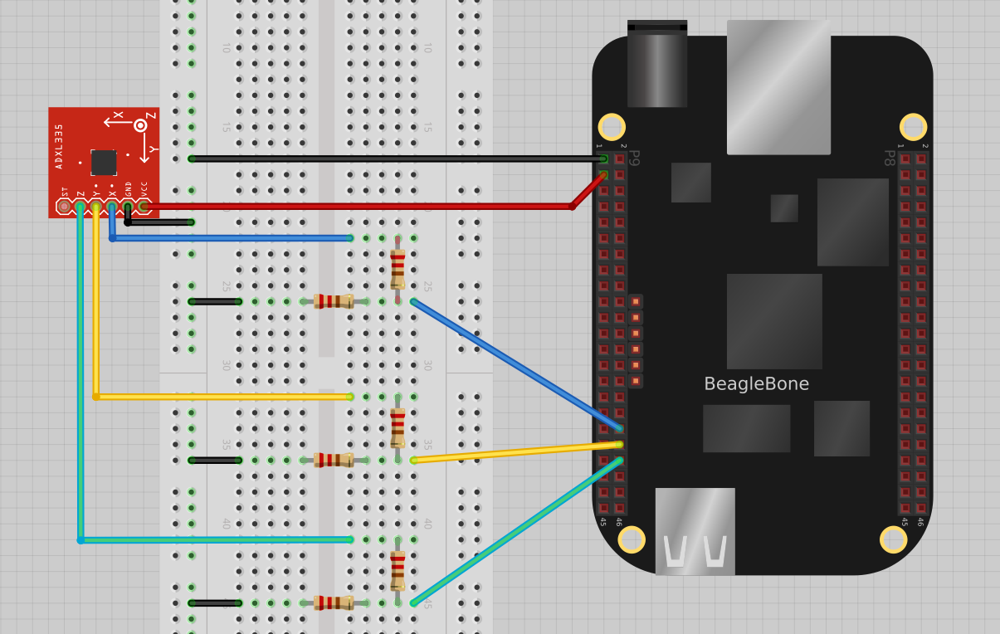

# Demo: Accelerometer

This example reads values from Sparkfun’s ADXL335 3-axis accelerometer. 
Because the output of the ADXL335 is between 0-3.3V and because BeagleBone's 
analogRead pins are 1.8V tolerant, we used a hardware (resistor) voltage divider 
on each of the accelerometer outputs. This provides a range of 0-1.65V to be 
read on BeagleBone analogRead pins.

* NOTE: Due to output impedance of the ADXL335 being ~32kOhms, 
a low resistor value for the voltage divider is recommended (between 500 Ohms- 1k Ohms).*

We need to do simple math before we continue. Ultimately, we want to know the 
value in G’s being exerted on the accelerometer. 
The output of the accelerometer is in volts. 
The first thing we need to do is calculate a formula that will convert volts to 
Gs for us in our software. This formula for us is:

(axisRead - zeroOffset) / (conversionFactor) = acceleration

Where: zeroOffset = 0.0917 and conversionFactor = 0.4584



## Build and execute instructions
* Hook up BeagleBone to the breadboard as shown in the diagram.

Accelerometer | Pin  | Bone  | Pocket
------------- | ---  | ----- | ------
GND           | GND  | P9_1  | P2_15
VCC           | 3.3V | P9_3  | P1_14
X             | AIN5 | P9_36 | P2_35
Y             | AIN3 | P9_38 | P1_25
Z             | AIN1 | P9_40 | P1_21

* After clicking ‘run’, notice the console output above for the accelerometer data.
* Experiment by altering the second argument in ```setTimeout(clear, x)``` to 
another number where x is a value in milliseconds 
(this value determines how long the example will run).
