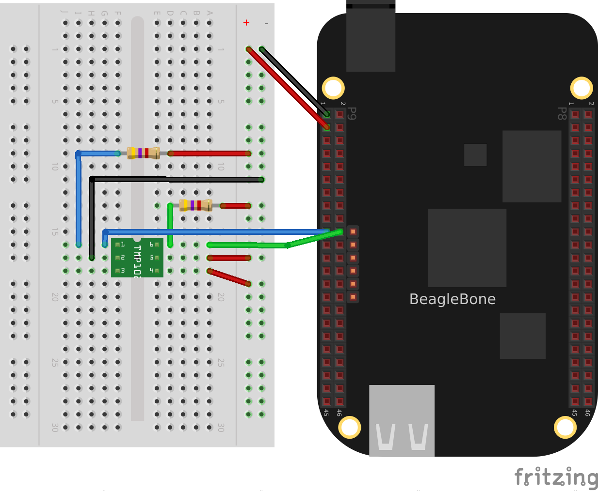

# Measuring a Temperature

You want to measure a temperature using a digital temperature sensor.

The TMP102 sensor is a common digital temperature sensor that uses a standard I^2^C-based serial protocol.

Wire the TMP102, as shown.



There are two I^2^C buses brought out to the headers. <<sensors_cape_headers_i2c>> shows that you have wired your device to I^2^C bus ```2```, but watch out: the buses aren't always numbered the same. When you work with BoneScript, they are numbered ```1``` and ```2```, but if you work from the Linux command line, they are numbered ```0``` and ```1```. Confusing, huh?


Once the I^2^C  device is wired up, you can use a couple handy I^2^C tools to test the device. Because these are Linux command-line tools, you have to use ```1``` as the bus number. ```i2cdetect```, shown in <<js_i2cTools>>, shows which I^2^C  devices are on the bus. The ```-r``` flag indicates which bus to use. Our TMP102 is appearing at address ```0x49```. You can use the ```i2cget``` command to read the value. It returns the temperature in hexidecimal and degrees C. In this example, 0x18 = 24{deg}C, which is 75.2{deg}F. (Hmmm, the office is a bit warm today.) Try warming up the TMP102 with your finger and running ```i2cget``` again.

```
bone# <strong>i2cdetect -y -r 1</strong>
     0  1  2  3  4  5  6  7  8  9  a  b  c  d  e  f
00:          -- -- -- -- -- -- -- -- -- -- -- -- -- 
10: -- -- -- -- -- -- -- -- -- -- -- -- -- -- -- -- 
20: -- -- -- -- -- -- -- -- -- -- -- -- -- -- -- -- 
30: -- -- -- -- -- -- -- -- -- -- -- -- -- -- -- -- 
40: -- -- -- -- -- -- -- -- -- 49 -- -- -- -- -- -- 
50: -- -- -- -- UU UU UU UU -- -- -- -- -- -- -- -- 
60: -- -- -- -- -- -- -- -- -- -- -- -- -- -- -- -- 
70: -- -- -- -- -- -- -- --

bone# <strong>i2cget -y 1 0x49</strong>
0x18
```
