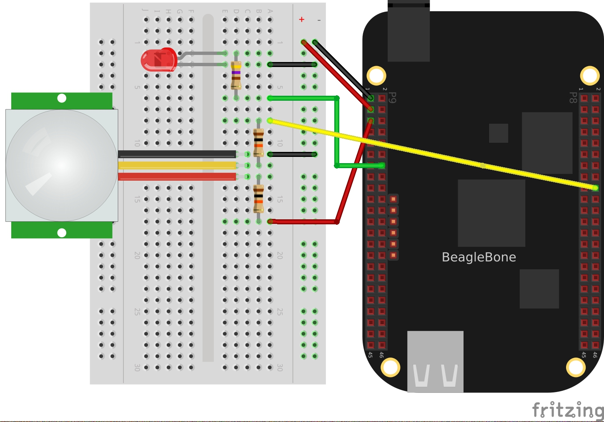

# Demo: PIR Motion Sensor
The PIR Motion Sensor, or Passive Infrared Sensor, is a sensor that takes a snapshot 
of the room and sets the ```alarm``` pin to ```LOW``` if it detects changes in heat. 
Since this sensor is an [open collector](http://en.wikipedia.org/wiki/Open_collector),
it needs a pull-up resistor on the alarm pin, which allows multiple motion sensors to 
be connected on a single input pin. If motion is detected in this
demo, it will output "Motion Detected" on the console and will turn on the LED.



## Build and execute instructions
* Connect the '+' pin from the sensor to 'P9_5' of the BeagleBoard in series with
a 10kohm resistor.
* Connect the '-' pin from the sensor to 'P9_1' of the BeagleBoard.
* Connect the 'AL' pin from the sensor to 'P8_19' of the BeagleBoard in series
with a 10kohm resistor.
* Connect the LED with a 470ohm resistor
* Click "Run" on the code. Every 2.5 seconds, the console will tell you if 
there was motion detected. If there was motion detected, the LED will also turn on.
