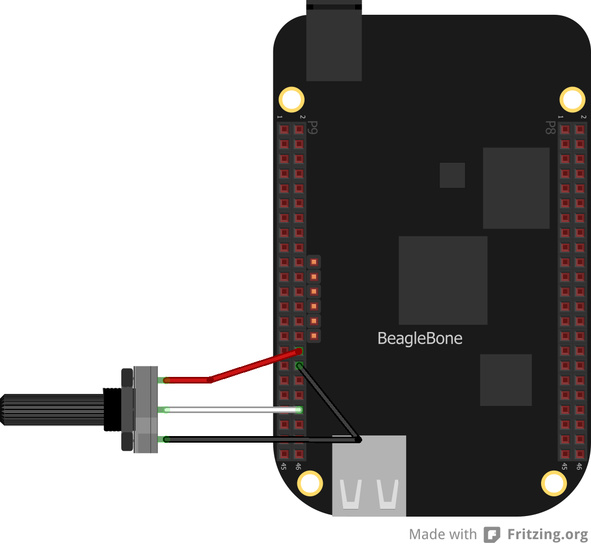

# Demo: Potentiometer

A specific voltage can be sent to the AIN1 channel using a potentiometer. 
Please keep in mind that each one of the ADC pins can only **handle 1.8V maximum**.

## Build and execute instructions
* Hook up a BeagleBone or BeagleBone Black to the breadboard as shown in the diagram.

Potentiometer  | Pin  | Bone  | Pocket
-------------- | ---  | ----- | ------
outer terminal | 1.8V | P9_32 | P1_18
outer terminal | GND  | P9_34 | P1_17
wiper (middle) | A1   | P9_40 | P1_21

* After clicking ‘run’, the ADC1 channel will output a reading between 0-1, 
where 0 is 0V and 1 is the maximum input voltage (1.8V).
* Adjust your potentiometer's knob and click run again. 
The lower the resistance, the higher voltage you will see.
* Alter the code to look at inputs on other analog input pins. 
A schematic showing all available ADC channels are listed 
[here](https://elinux.org/Beagleboard:Cape_Expansion_Headers#Cape_Expansion_Headers).

Analog pin mapping on AI

Bone P9 | AIN | /sys/bus/iio/devices/iio:device0/in_voltage*_raw
------- | --- | ---
39      | 0   | 0
40      | 1   | 1
37      | 2   | 3
38      | 3   | 2
33      | 4   | 7
36      | 5   | 6
35      | 6   | 4

Analog pin mapping on Black/Pocket

Black P9 | Pocket P | AIN | /sys/bus/iio/devices/iio:device0/in_voltage*_raw
-------- | -------- | --- | ---
39       | 1_19     | 0   | 0
40       | 1_21     | 1   | 1
37       | 1_23     | 2   | 2
38       | 1_25     | 3   | 3
33       | 1_27     | 4   | 4
36       | 2_35     | 5   | 5
35       | 1_02     | 6   | 6
